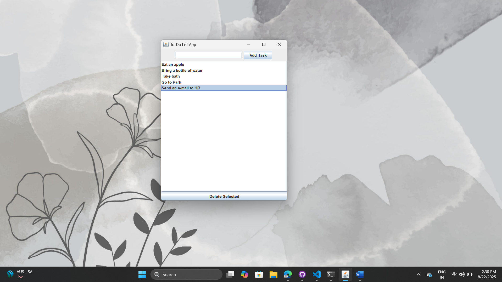
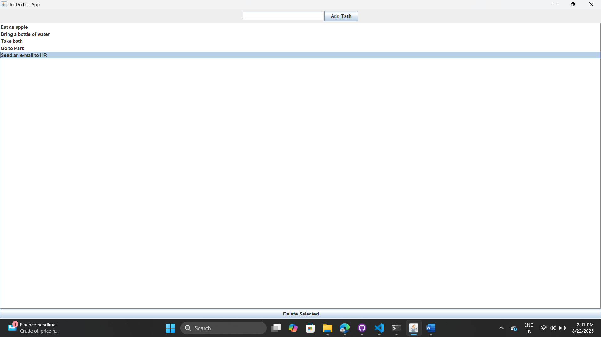

# Java To-Do List App 📝

A simple and user-friendly **To-Do List application** built using **Java Swing**.  
This project helps users **add, delete, and manage their daily tasks** with a GUI-based interface.

## 📷 Screenshots

**Main Interface**

**After Adding Tasks**

## 🛠 Features

- Add new tasks
- Mark tasks as done (optional)
- Delete selected tasks
- Scrollable task list
- Lightweight, responsive GUI

## 🚀 Tech Used

- Java
- Swing (GUI)

## 👨‍💻 Author

**Nishi**  
📍Ghaziabad , Uttar Pradesh
🎓 B.Tech Student  
💻 Aspiring Java Developer

GitHub: [nishii1](https://github.com/nishii1)

---

## 📌 Future Improvements

- Save tasks to file (persistence)
- Task deadlines
- Task categories

---

Enjoy organizing your tasks! 🎯
